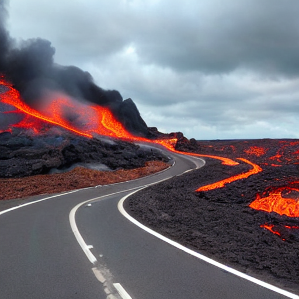
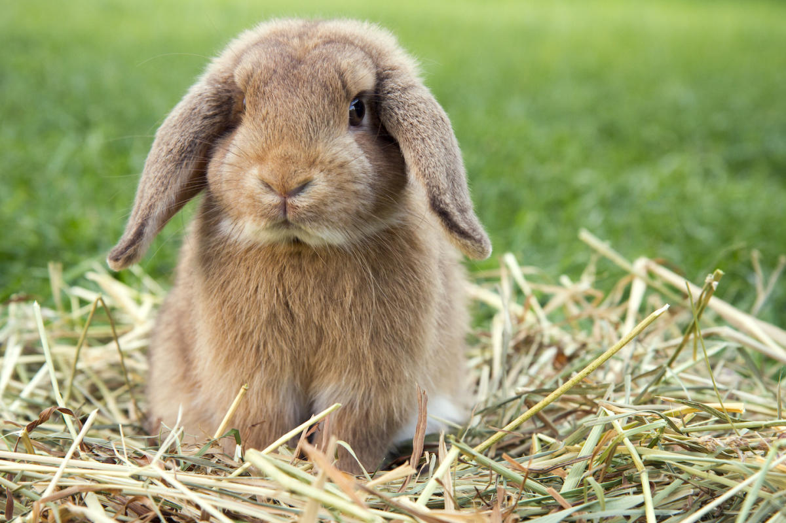
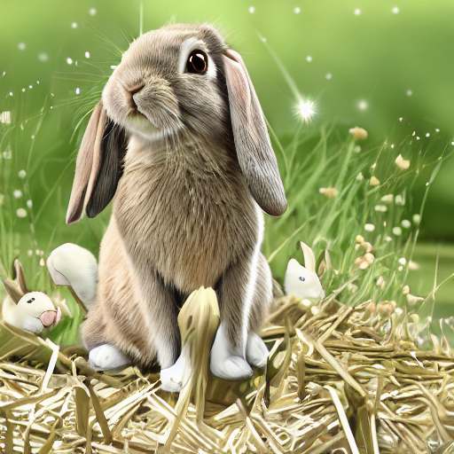
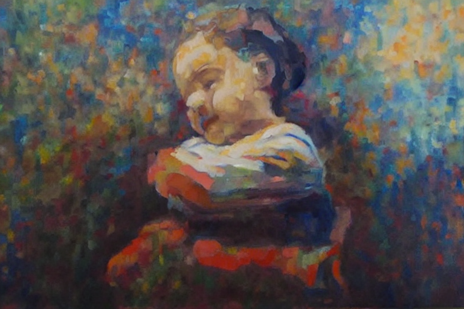

# StableDiffusionImageGenerator
A python project to generate images using the Stable Diffusion Model and the Hugging Face API. <br>
Check out my blog for further details: <br>
https://medium.com/@deodeshmukh.aditya/using-ai-to-generate-images-a-blog-on-stable-diffusion-e6204811679b

The Stable Diffusion model is used to generate images using various kinds of pipelines, including pre-existing pipelines such as image-to-image, text-to-image pipelines as well as custom pipelines such as weighted multiple image-to-image pipeline. <br>
## Installation
1. Install python on your local system
2. Install CUDA and CUDNN on your local system.
3. Install the required packages in your folder. <br>
For this run the following command in your terminal
```
pip install requirements.txt
```
## Running the Pipelines

### Text-to-Image:
Run the following command in your terminal to generate an image when given a specific prompt:
```
python .\Image_Generators\text_to_image.py "<prompt>"
```
### Image-to-Image:
Place your images in a folder named "Stored_Images" <br>
Run the following command in your terminal to generate an image when given a specific prompt and an image to model:
```
python .\Image_Generators\image_to_image.py "<prompt>" "<image_name>"
```
### Multiple Images-to-Image:
Place your images in a folder named "Stored_Images" <br>
Run the following command in your terminal to generate an image when given a specific prompt and a weighted image needs to be calculated from 2 images:
```
python .\Image_Generators\image_from_mult_image.py "<prompt>" "<image_name>"
```
### Linear Interpolation:
Place your images in a folder named "Stored_Images" <br>
Run the following command in your terminal to generate an transition from one image to another:
```
python .\Image_Generators\linear_interpolation.py "<prompt>" "<Image1>" "<Image2>" 
```
<b>Note:</b> To know more about optional parameters enter the command
```
python .\Image_Generators\<Function_Name>.py -h
```
## Results
### Text-to-Image:

A highway with lava on the side

### Image-to-Image:

This is the original Image

This is the generated image

### Weighted Multiple Image-to-Image

This image is 50% the Mona Lisa and 50% the Starry Night

### Linear Interpolation
 <br>
This is the linear interpolation between 2 Candy Castles
